<div align="center">

# 🚀 Claude Code Open

*A universal LLM proxy that connects Claude Code to any language model provider*

[](https://golang.org)
[](LICENSE)
[]()

**Production-ready LLM proxy server** that converts requests from various LLM providers to Anthropic's Claude API format. Built with Go for high performance and reliability.

---

*Inspired by [Claude Code Router](https://github.com/musistudio/claude-code-router) but rebuilt from the ground up to actually work reliably.*

</div>

## ✨ Features

<table>
<tr>
<td width="50%">

### 🌐 Multi-Provider Support
- **OpenRouter** - Multiple models from different providers
- **OpenAI** - Direct GPT model access
- **Anthropic** - Native Claude model support
- **NVIDIA** - Nemotron models via API
- **Google Gemini** - Gemini model family

### ⚡ Zero-Config Setup
- Run with just `CCO_API_KEY` environment variable
- No configuration file required to get started
- Smart defaults for all providers

</td>
<td width="50%">

### 🔧 Advanced Configuration
- **YAML Configuration** with automatic defaults
- **Model Whitelisting** with pattern matching
- **Dynamic Model Selection** using comma notation
- **API Key Protection** for enhanced security

### 🔄 Smart Request Handling
- **Dynamic Request Transformation** between formats
- **Automatic Provider Detection** and routing
- **Streaming Support** for all providers

</td>
</tr>
</table>

## 🚀 Quick Start

> **💡 Note**: When installed with `go install`, the binary is named `claude-code-open`. Throughout this documentation, you can substitute `cco` with `claude-code-open` or create an alias as shown in the installation section.

### 📦 Installation

<details>
<summary><b>📥 Option 1: Install with Go (Recommended)</b></summary>

<br>

The easiest way to install is using Go's built-in installer:

```bash
# Install directly from GitHub
go install github.com/Davincible/claude-code-open@latest

# The binary will be installed as 'claude-code-open' in $(go env GOBIN) or $(go env GOPATH)/bin
# Create an alias for shorter command (optional)
echo 'alias cco="claude-code-open"' >> ~/.bashrc  # or ~/.zshrc
source ~/.bashrc  # or ~/.zshrc

# Or create a symlink (Linux/macOS) - handles both GOBIN and GOPATH
GOBIN_DIR=$(go env GOBIN)
if [ -z "$GOBIN_DIR" ]; then
    GOBIN_DIR="$(go env GOPATH)/bin"
fi
sudo ln -s "$GOBIN_DIR/claude-code-open" /usr/local/bin/cco

# One-liner version:
# sudo ln -s "$([ -n "$(go env GOBIN)" ] && go env GOBIN || echo "$(go env GOPATH)/bin")/claude-code-open" /usr/local/bin/cco
```

</details>

<details>
<summary><b>🔨 Option 2: Build from Source</b></summary>

<br>

```bash
# Clone the repository
git clone https://github.com/Davincible/claude-code-open
cd claude-code-open

# Build with Make (creates 'cco' binary)
make build
sudo make install  # Install to /usr/local/bin

# Or build manually
go build -o cco .
sudo mv cco /usr/local/bin/
```

</details>

<details>
<summary><b>⚙️ Option 3: Install with Custom Binary Name</b></summary>

<br>

```bash
# Install with go install and create symlink using Go environment
go install github.com/Davincible/claude-code-open@latest
GOBIN_DIR=$(go env GOBIN); [ -z "$GOBIN_DIR" ] && GOBIN_DIR="$(go env GOPATH)/bin"
sudo ln -sf "$GOBIN_DIR/claude-code-open" /usr/local/bin/cco

# Or use go install with custom GOBIN (if you have write permissions)
GOBIN=/usr/local/bin go install github.com/Davincible/claude-code-open@latest
sudo mv /usr/local/bin/claude-code-open /usr/local/bin/cco

# Or install to a custom directory you own
mkdir -p ~/.local/bin
GOBIN=~/.local/bin go install github.com/Davincible/claude-code-open@latest
ln -sf ~/.local/bin/claude-code-open ~/.local/bin/cco
# Add ~/.local/bin to PATH if not already there
echo 'export PATH="$HOME/.local/bin:$PATH"' >> ~/.bashrc
```

</details>

---

### 🔑 Quick Start with CCO_API_KEY

For the fastest setup, you can run without any configuration file using just the `CCO_API_KEY` environment variable:

```bash
# Set your API key (works with any provider)
# This is the API key of the provider you want to use, can be any one of the supported providers
# Then in Claude Code you set the model with <provider>,<model name> e.g. openrouter,moonshotai/kimi-k2
export CCO_API_KEY="your-api-key-here"

# Start the router immediately - no config file needed!
# Although you can create a config if you want to store your API keys for all providers
cco start  # or claude-code-open start

# The API key will be used for whichever provider your model requests
# e.g., if you use "openrouter,anthropic/claude-3.5-sonnet" -> key goes to OpenRouter
# e.g., if you use "openai,gpt-4o" -> key goes to OpenAI
```

<div align="center">
<table>
<tr><th>🔑 How CCO_API_KEY Works</th></tr>
<tr><td>

✅ **Single API Key** - Use one environment variable for all providers  
✅ **Provider Detection** - Key automatically routed to correct provider  
✅ **No Config Required** - Run immediately without config files  
✅ **Fallback Priority** - Provider-specific keys take precedence  

</td></tr>
</table>
</div>

### ⚙️ Full Configuration (Optional)

For advanced setups with multiple API keys, generate a complete YAML configuration:

```bash
cco config generate  # or claude-code-open config generate
```

This creates `config.yaml` with all 5 supported providers and sensible defaults. Then edit the file to add your API keys:

```yaml
# config.yaml
host: 127.0.0.1
port: 6970
api_key: your-proxy-key  # Optional: protect the proxy

providers:
  - name: openrouter
    api_key: your-openrouter-api-key
    model_whitelist: ["claude", "gpt-4"]  # Optional: filter models
  - name: openai
    api_key: your-openai-api-key
  # ... etc
```

Alternatively, use the interactive setup:

```bash
cco config init  # or claude-code-open config init
```

### 🎯 Usage

<table>
<tr>
<td width="50%">

**🚀 Start the Service**
```bash
cco start
# or
claude-code-open start
```

**📊 Check Status**
```bash
cco status
# or
claude-code-open status
```

</td>
<td width="50%">

**💬 Use with Claude Code**
```bash
cco code [arguments]
# or
claude-code-open code [...]
# Auto-starts if not running
```

**⏹️ Stop the Service**
```bash
cco stop
# or
claude-code-open stop
```

</td>
</tr>
</table>

## 🔄 Dynamic Model Selection

The router supports explicit provider and model selection using comma notation, which overrides all automatic routing logic:

<div align="center">
<table>
<tr><th>🤖 Automatic Routing (Fallback)</th></tr>
<tr><td>

When no comma is present in the model name, the router applies these rules in order:

1. **📄 Long Context** - If tokens > 60,000 → use `LongContext` config
2. **⚡ Background Tasks** - If model starts with "claude-3-5-haiku" → use `Background` config  
3. **🎯 Default Routing** - Use `Think`, `WebSearch`, or model as-is

</td></tr>
</table>
</div>

## 🏗️ Architecture

### 🧩 Core Components

<table>
<tr>
<td width="50%">

📁 **`internal/config/`** - Configuration management  
🔌 **`internal/providers/`** - Provider implementations  
🌐 **`internal/server/`** - HTTP server and routing  
🎯 **`internal/handlers/`** - Request handlers (proxy, health)  

</td>
<td width="50%">

🔧 **`internal/middleware/`** - HTTP middleware (auth, logging)  
⚙️ **`internal/process/`** - Process lifecycle management  
💻 **`cmd/`** - CLI command implementations  

</td>
</tr>
</table>

### 🔌 Provider System

The router uses a modular provider system where each provider implements the `Provider` interface:

```go
type Provider interface {
    Name() string
    SupportsStreaming() bool
    TransformRequest(request []byte) ([]byte, error)
    TransformResponse(response []byte) ([]byte, error)
    TransformStream(chunk []byte, state *StreamState) ([]byte, error)
    IsStreaming(headers map[string][]string) bool
    GetEndpoint() string
    SetAPIKey(key string)
}
```

### 🔄 Request Flow

```mermaid
graph TD
    A[📱 Client Request] --> B[🔐 Authentication]
    B --> C[🎯 Model Selection]
    C --> D[🔌 Provider Selection]
    D --> E[🔄 Transform Request]
    E --> F[🌐 Proxy to Provider]
    F --> G[🔄 Transform Response]
    G --> H[📡 Stream to Client]
```

<div align="center">



</div>

1. **📱 Client Request** - Client sends request to router
2. **🔐 Authentication** - Router authenticates request (if API key configured)
3. **🎯 Model Selection** - Router selects appropriate model based on routing
4. **🔌 Provider Selection** - Router identifies provider based on configuration
5. **🔄 Transform Request** - Provider transforms Claude format to provider format
6. **🌐 Proxy to Provider** - Router proxies request to upstream provider
7. **🔄 Transform Response** - Provider transforms response back to Claude format
8. **📡 Stream to Client** - Router streams response to client

## ⚙️ Configuration

### 📁 Configuration File Location

<table>
<tr>
<td width="50%">

**🐧 Linux/macOS**
- `~/.claude-code-open/config.yaml` *(preferred)*
- `~/.claude-code-open/config.json`

</td>
<td width="50%">

**🪟 Windows**  
- `%USERPROFILE%\.claude-code-open\config.yaml` *(preferred)*
- `%USERPROFILE%\.claude-code-open\config.json`

</td>
</tr>
</table>

> **🔄 Backward Compatibility**: The router will also check `~/.claude-code-router/` for existing configurations and use them automatically, with a migration notice.

### 📄 YAML Configuration Format (Recommended)

The router now supports modern YAML configuration with automatic defaults:

```yaml
# Server settings
host: 127.0.0.1
port: 6970
api_key: your-proxy-key-here  # Optional: protect proxy with authentication

# Provider configurations  
providers:
  # OpenRouter - Access to multiple models
  - name: openrouter
    api_key: your-openrouter-api-key
    # url: auto-populated from defaults
    # default_models: auto-populated with curated list
    model_whitelist: ["claude", "gpt-4"]  # Optional: filter models by pattern

  # OpenAI - Direct GPT access
  - name: openai
    api_key: your-openai-api-key
    # Automatically configured with GPT-4, GPT-4-turbo, GPT-3.5-turbo

  # Anthropic - Direct Claude access
  - name: anthropic
    api_key: your-anthropic-api-key
    # Automatically configured with Claude models

  # Nvidia - Nemotron models
  - name: nvidia 
    api_key: your-nvidia-api-key

  # Google Gemini
  - name: gemini
    api_key: your-gemini-api-key

# Router configuration for different use cases
router:
  default: openrouter/anthropic/claude-3.5-sonnet
  think: openai/o1-preview
  long_context: anthropic/claude-3-5-sonnet-20241022
  background: anthropic/claude-3-haiku-20240307
  web_search: openrouter/perplexity/llama-3.1-sonar-huge-128k-online
```

### 📜 Legacy JSON Format

<details>
<summary><b>📋 JSON Configuration (Click to expand)</b></summary>

<br>

The router still supports JSON configuration for backward compatibility:

```json
{
  "HOST": "127.0.0.1",
  "PORT": 6970,
  "APIKEY": "your-router-api-key-optional",
  "Providers": [
    {
      "name": "openrouter",
      "api_base_url": "https://openrouter.ai/api/v1/chat/completions",
      "api_key": "your-provider-api-key",
      "models": ["anthropic/claude-3.5-sonnet"],
      "model_whitelist": ["claude", "gpt-4"],
      "default_models": ["anthropic/claude-3.5-sonnet"]
    }
  ],
  "Router": {
    "default": "openrouter,anthropic/claude-3.5-sonnet",
    "think": "openrouter,anthropic/claude-3.5-sonnet", 
    "longContext": "openrouter,anthropic/claude-3.5-sonnet-20241022",
    "background": "openrouter,anthropic/claude-3.5-haiku",
    "webSearch": "openrouter,perplexity/llama-3.1-sonar-large-128k-online"
  }
}
```

</details>

### ⚙️ Configuration Features

<table>
<tr>
<td width="50%">

✅ **Auto-Defaults** - URLs and model lists auto-populated  
✅ **YAML Priority** - YAML takes precedence over JSON  
✅ **Model Whitelisting** - Filter models by pattern  

</td>
<td width="50%">

✅ **Smart Model Management** - Auto-filtered by whitelists  
✅ **Proxy Protection** - Optional API key authentication  

</td>
</tr>
</table>

### 🗺️ Router Configuration

<table>
<tr>
<td width="50%">

🎯 **`default`** - Default model when none specified  
🧠 **`think`** - Complex reasoning tasks (e.g., o1-preview)  
📄 **`long_context`** - Requests with >60k tokens  

</td>
<td width="50%">

⚡ **`background`** - Background/batch processing  
🌐 **`web_search`** - Web search enabled tasks  

</td>
</tr>
</table>

> **Format**: `provider_name/model_name` (e.g., `openai/gpt-4o`, `anthropic/claude-3-5-sonnet`)

## 💻 Commands

### 🔧 Service Management

<table>
<tr>
<td width="33%">

**🚀 Start Service**
```bash
cco start [--verbose] [--log-file]
```

</td>
<td width="33%">

**📊 Check Status**
```bash
cco status
```

</td>
<td width="33%">

**⏹️ Stop Service**
```bash
cco stop
```

</td>
</tr>
</table>

### ⚙️ Configuration Management

<table>
<tr>
<td width="50%">

**📁 Generate Config**
```bash
cco config generate [--force]
```

**🔧 Interactive Setup**
```bash
cco config init
```

</td>
<td width="50%">

**👁️ Show Config**
```bash
cco config show
```

**✅ Validate Config**
```bash
cco config validate
```

</td>
</tr>
</table>

### 💬 Claude Code Integration

```bash
# Run Claude Code through the router
cco code [args...]

# Examples:
cco code --help
cco code "Write a Python script to sort a list"
cco code --resume session-name
```

## 🔌 Adding New Providers

To add support for a new LLM provider:

1. **Create Provider Implementation**:
   ```go
   // internal/providers/newprovider.go
   type NewProvider struct {
       name     string
       endpoint string
       apiKey   string
   }
   
   func (p *NewProvider) TransformRequest(request []byte) ([]byte, error) {
       // Implement Claude → Provider format transformation
   }
   
   func (p *NewProvider) TransformResponse(response []byte) ([]byte, error) {
       // Implement Provider → Claude format transformation
   }
   
   func (p *NewProvider) TransformStream(chunk []byte, state *StreamState) ([]byte, error) {
       // Implement streaming response transformation (Provider → Claude format)
   }
   ```

2. **Register Provider**:
   ```go
   // internal/providers/registry.go
   func (r *Registry) Initialize() {
       r.Register(NewOpenRouterProvider())
       r.Register(NewOpenAIProvider())
       r.Register(NewAnthropicProvider())
       r.Register(NewNvidiaProvider())
       r.Register(NewGeminiProvider())
       r.Register(NewYourProvider()) // Add here
   }
   ```

3. **Update Domain Mapping**:
   ```go
   // internal/providers/registry.go
   domainProviderMap := map[string]string{
       "your-provider.com": "yourprovider",
       // ... existing mappings
   }
   ```

## 🚧 Development

### 📋 Prerequisites

<table>
<tr>
<td width="50%">

🐹 **Go 1.24.4** or later  
🔑 **LLM Provider API Access** (OpenRouter, OpenAI, etc.)  

</td>
<td width="50%">

💻 **Development Tools** (optional)  
🔥 **Air** (hot reload - auto-installed)  

</td>
</tr>
</table>

### 🔥 Development with Hot Reload

```bash
# Development with hot reload (automatically installs Air if needed)
make dev

# This will:
# - Install Air if not present
# - Start the server with `cco start --verbose`
# - Watch for Go file changes
# - Automatically rebuild and restart on changes
```

### 🏗️ Building

<table>
<tr>
<td width="50%">

**🔨 Single Platform**
```bash
go build -o cco .
# or
make build
task build
```

**🌍 Cross-Platform**
```bash
make build-all
task build-all
```

</td>
<td width="50%">

**🎯 Manual Cross-Compilation**
```bash
GOOS=linux GOARCH=amd64 go build -o cco-linux-amd64 .
GOOS=darwin GOARCH=amd64 go build -o cco-darwin-amd64 .
GOOS=windows GOARCH=amd64 go build -o cco-windows-amd64.exe .
```

</td>
</tr>
</table>

### 🧪 Testing

<table>
<tr>
<td width="33%">

**🔍 Basic Tests**
```bash
go test ./...
make test
task test
```

</td>
<td width="33%">

**📊 Coverage**
```bash
go test -cover ./...
make coverage
task test-coverage
```

</td>
<td width="33%">

**🛡️ Security**
```bash
task security
task benchmark  
task check
```

</td>
</tr>
</table>

### ⚡ Task Runner

The project includes both a traditional `Makefile` and a modern `Taskfile.yml` for task automation. [Task](https://taskfile.dev/) provides more powerful features and better cross-platform support.

<details>
<summary><b>📋 Available Tasks (Click to expand)</b></summary>

<br>
```bash
# Core development tasks
task build              # Build the binary
task test               # Run tests 
task fmt                # Format code
task lint               # Run linter
task clean              # Clean build artifacts

# Advanced tasks
task dev                # Development mode with hot reload
task build-all          # Cross-platform builds
task test-coverage      # Tests with coverage report
task benchmark          # Run benchmarks
task security           # Security audit
task check              # All checks (fmt, lint, test, security)

# Service management
task start              # Start the service (builds first)
task stop               # Stop the service
task status             # Check service status

# Configuration
task config-generate    # Generate example config
task config-validate    # Validate current config

# Utilities
task deps               # Download dependencies
task mod-update         # Update all dependencies
task docs               # Start documentation server
task install            # Install to system
task release            # Create release build
```

</details>

## 🚀 Production Deployment

### 🐧 Systemd Service (Linux)

Create `/etc/systemd/system/claude-code-open.service`:

```ini
[Unit]
Description=Claude Code Open
After=network.target

[Service]
Type=simple
User=your-user
ExecStart=/usr/local/bin/cco start
# Or if using go install without symlink:
# ExecStart=%h/go/bin/claude-code-open start
# Or with dynamic Go path:
# ExecStartPre=/usr/bin/env bash -c 'echo "GOPATH: $(go env GOPATH)"'
# ExecStart=/usr/bin/env bash -c '"$(go env GOPATH)/bin/claude-code-open" start'
Restart=always
RestartSec=5

[Install]
WantedBy=multi-user.target
```

Enable and start:
```bash
sudo systemctl enable claude-code-open
sudo systemctl start claude-code-open
```

### 🌐 Environment Variables

The router respects these environment variables:

<table>
<tr>
<td width="50%">

🔑 **`CCO_API_KEY`** - Universal API key for all providers  
🏠 **`CCO_HOST`** - Override host binding  
🔌 **`CCO_PORT`** - Override port binding  

</td>
<td width="50%">

📁 **`CCO_CONFIG_PATH`** - Override config file path  
📊 **`CCO_LOG_LEVEL`** - Set log level (debug, info, warn, error)  

</td>
</tr>
</table>

#### 🔑 CCO_API_KEY Behavior

<div align="center">
<table>
<tr><th>🔑 How CCO_API_KEY Works</th></tr>
<tr><td>

1️⃣ **No Config File** - Creates minimal config with all providers  
2️⃣ **Config File Exists** - Serves as fallback for missing provider keys  
3️⃣ **Provider Selection** - Key sent to requested provider automatically  
4️⃣ **Priority** - Provider-specific keys override CCO_API_KEY  

</td></tr>
</table>
</div>

```bash
# Use your OpenAI API key directly with OpenAI
export CCO_API_KEY="sk-your-openai-key"
cco start

# This request will use your OpenAI key:
# - "openai,gpt-4o"
```

## 📊 Monitoring

### 💓 Health Check

```bash
curl http://localhost:6970/health
```

### 📝 Logs & Metrics

<table>
<tr>
<td width="50%">

**📋 Log Information**
- Request routing and provider selection
- Token usage (input/output)  
- Response times and status codes
- Error conditions and debugging info

</td>
<td width="50%">

**📈 Operational Metrics**
- Request count and response times
- Token usage statistics  
- Provider response status codes
- Error rates by provider

</td>
</tr>
</table>

## 🔧 Troubleshooting

### ⚠️ Common Issues

<table>
<tr>
<td width="50%">

**🚫 Service Won't Start**
- Check config: `cco config validate`
- Check port: `netstat -ln | grep :6970`
- Enable verbose: `cco start --verbose`

**🔑 Authentication Errors**
- Verify provider API keys in config
- Check router API key if enabled
- Ensure Claude Code env vars are set

</td>
<td width="50%">

**⚙️ Transformation Errors**
- Enable verbose logging for details
- Check provider compatibility
- Verify request format matches schema

**🐌 Performance Issues**
- Monitor token usage in logs
- Use faster models for background tasks
- Check network latency to provider APIs

</td>
</tr>
</table>

### 🐛 Debug Mode

```bash
cco start --verbose
```

<div align="center">
<table>
<tr><th>🔍 Debug Information</th></tr>
<tr><td>

✅ Request/response transformations  
✅ Provider selection logic  
✅ Token counting details  
✅ HTTP request/response details  

</td></tr>
</table>
</div>

## 📜 License

This project is licensed under the **MIT License** - see the [LICENSE](LICENSE) file for details.

## 📈 Changelog

<details>
<summary><b>🎯 v0.3.0 - Latest Release</b></summary>

<br>

✨ **New Providers** - Added Nvidia and Google Gemini support (5 total providers)  
📄 **YAML Configuration** - Modern YAML config with automatic defaults  
🔍 **Model Whitelisting** - Filter available models per provider using patterns  
🔐 **API Key Protection** - Optional proxy-level authentication  
💻 **Enhanced CLI** - New `cco config generate` command  
🧪 **Comprehensive Testing** - 100% test coverage for all providers  
📋 **Default Model Management** - Auto-populated curated model lists  
🔄 **Streaming Tool Calls** - Fixed complex streaming parameter issues  

</details>

<details>
<summary><b>⚡ v0.2.0 - Architecture Overhaul</b></summary>

<br>

🏗️ **Complete Refactor** - Modular architecture  
🔌 **Multi-Provider Support** - OpenRouter, OpenAI, Anthropic  
💻 **Improved CLI Interface** - Better user experience  
🛡️ **Production-Ready** - Error handling and logging  
⚙️ **Configuration Management** - Robust config system  
🔄 **Process Lifecycle** - Proper service management  

</details>

<details>
<summary><b>🌱 v0.1.0 - Initial Release</b></summary>

<br>

🎯 **Proof-of-Concept** - Initial implementation  
🔌 **Basic OpenRouter** - Single provider support  
🌐 **Simple Proxy** - Basic functionality  

</details>

---

<div align="center">

**Made with ❤️ for the Claude Code community**

</div>
